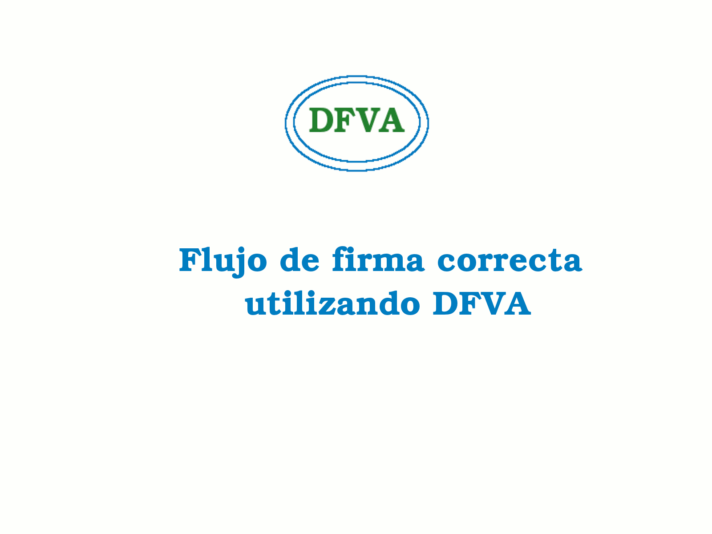
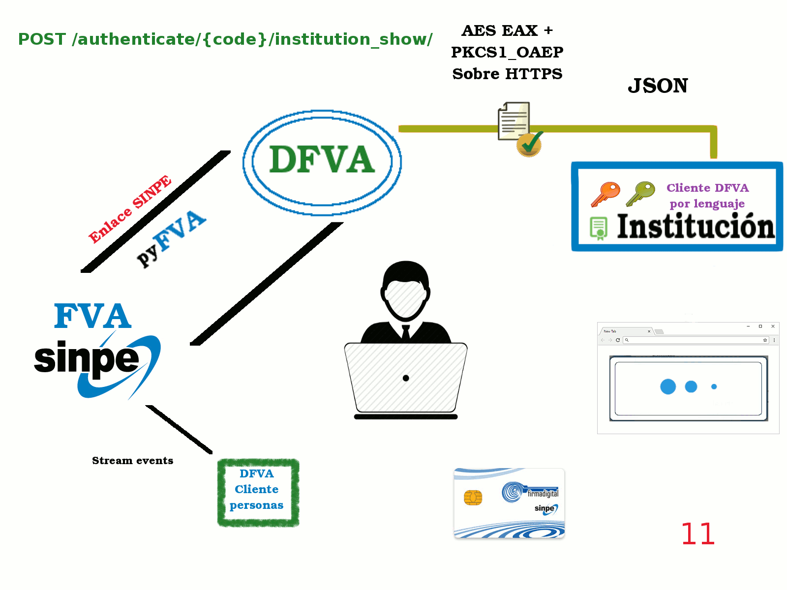
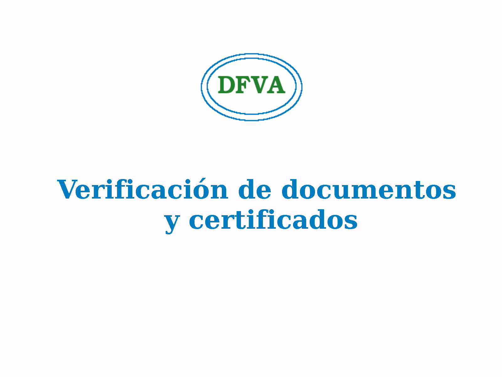

Flujos de interación
=======================

Instituciones
-----------------

Flujo de Autenticación
~~~~~~~~~~~~~~~~~~~~~~~~

.. image:: _static/autenticacion_institucion.gif

#. El usuario ingresa a la plataforma de la institución y se le despliega un modal donde se le pide la identificación

#. La identificación se envía a la plataforma de la institución

#. La aplicación mediante alguna de las bibliotecas de comunicación con dfva envía la petición utilizando un canal https vía JSON y encritpta en el atributo **data** la información, usando AES EAX + PKCS1_OEAP.

#. Dentro de DFVA se verifica que:

  * La institución está registrada y activa
  * La URL de notificación está registrada o la aplicación fue inscrita sin URL de notificación (para aplicaciones no web).
  * El certificado está vigente y es válido.
  * Los datos pueden ser desencriptados usando la llave privada de DFVA asignada a la aplicación.
  * La suma de verificación de los datos son iguales.

  En caso de que alguna de estas verificaciones falle DFVA devolverá un error.

5. La petición es almacenada en la base de datos y enviada mediante PyFVA al servicio de FVA del BCCR utilizando un canal SINPE.

#. Cuando se recibe la respuesta del FVA el código se guarda en la base de datos actualizando la información de la petición.

#. La respuesta se envía a la institución mediante el mismo canal usando JSON y encriptando el atributo **data** con AES EAX + PKCS1_OEAP. Se utiliza la llave pública de la aplicación para encriptar la comunicación (nunca publicada).

#. El código de identificación se le muestra al usuario y el usuario mediante el cliente de firma del BCCR firma la petición de autenticación.

#. El FVA del BCCR notifica a DFVA que el usuario ha firmado la autenticación, una vez que llega a DFVA se almacena en la base de datos.

#. Si la aplicación provee una URL de notificación se envía la notificación usando JSON y encriptando el atributo **data** con AES EAX + PKCS1_OEAP. Se utiliza la llave pública de la aplicación para encriptar la comunicación (nunca publicada).

#. Una vez la aplicación de la institución es notificada se autentica al usuario y se redirecciona al usuario a una vista autenticada.

#. Mientras tanto periódicamente se eliminan los datos de las peticiones vencidas guardando dentro de un archivo de log las peticiones eliminadas.

Flujo de estado de petición de Autenticación
~~~~~~~~~~~~~~~~~~~~~~~~~~~~~~~~~~~~~~~~~~~~~~~~

El proceso de verificación inicia a partir del paso 11 del flujo de autenticación, osea a partir de la llegada del token a la aplicación de la institución. 

11. La aplicación de la institución solicita el estado de la solicitud utilizando el id de transacción, para esto utilizará un canal https usando JSON y encriptando el atributo **data** con AES EAX + PKCS1_OEAP. La encripción se crea usando la llave publica del DFVA para la aplicación.

#. Se realizan las mismas verificaciones del paso 4 del proceso de autenticación y además se verifica que el id de transacción haya sido suministrado por DFVA. En caso de que alguna de estas verificaciones falle DFVA devolverá un error.

#. Se consulta en la Base de datos usando el id de transacción y se devuelve el resultado almacenado, mediante el mismo canal usando JSON y encriptando el atributo **data** con AES EAX + PKCS1_OEAP. Se utiliza la llave pública de la aplicación para encriptar la comunicación (nunca publicada).

#. En caso de que la información suministrada indique que el usuario está correctamente autenticado la aplicación redireccionará a una vista autenticada.

Flujo de Firma
~~~~~~~~~~~~~~~~~~

#. El usuario navega dentro de la plataforma de la institución hasta que requiere alguna firma, en ese punto se le despliega un botón qien al hacer click envía una petición post y muestra un modal notificando al usuario que espere.

#. La plataforma de la institución es la encargada de saber que es lo que el usuario desea firma y debe enviarlo mediante alguna de las bibliotecas de comunicación con dfva utilizando un canal https vía JSON y encritpta en el atributo **data** la información, usando AES EAX + PKCS1_OEAP.

Dentro de DFVA se verifica que:

  * La institución está registrada y activa
  * La URL de notificación está registrada o la aplicación fue inscrita sin URL de notificación (para aplicaciones no web).
  * El certificado está vigente y es válido.
  * Los datos pueden ser desencriptados usando la llave privada de DFVA asignada a la aplicación.
  * La suma de verificación de los datos son iguales.

  En caso de que alguna de estas verificaciones falle DFVA devolverá un error.

3. La petición es almacenada en la base de datos y enviada mediante PyFVA al servicio de FVA del BCCR utilizando un canal SINPE.

#. Cuando se recibe la respuesta del FVA el código se guarda en la base de datos actualizando la información de la petición.

#. La respuesta se envía a la institución mediante el mismo canal usando JSON y encriptando el atributo **data** con AES EAX + PKCS1_OEAP. Se utiliza la llave pública de la aplicación para encriptar la comunicación (nunca publicada).

#. El código de identificación se le muestra al usuario y el usuario mediante el cliente de firma del BCCR firma la petición de firma.

#. El FVA del BCCR notifica a DFVA que el usuario ha firmado la autenticación, una vez que llega a DFVA se almacena en la base de datos.

#. Si la aplicación provee una URL de notificación se envía la notificación usando JSON y encriptando el atributo **data** con AES EAX + PKCS1_OEAP. Se utiliza la llave pública de la aplicación para encriptar la comunicación (nunca publicada).

#. Una vez la aplicación de la institución es notificada la aplicación realizará lo que necesite con el documento firmado.

#. Mientras tanto periódicamente se eliminan los datos de las peticiones vencidas guardando dentro de un archivo de log las peticiones eliminadas.

Flujo de estado de petición de firma
~~~~~~~~~~~~~~~~~~~~~~~~~~~~~~~~~~~~~~~~~~~~~~~~

Este flujo es idéntico al flujo de chequeo del autenticación, la única diferencia corresponde a los datos entregados como respuesta, en los cuales se agrega el documento firmado si existe.

Flujo de verificación
~~~~~~~~~~~~~~~~~~~~~~

#. El usuario interactua con la aplicación y por alguna razón la aplicación requiere verificar un certificado o un documento.

#. La aplicación mediante alguna de las bibliotecas de comunicación con dfva envía la petición utilizando un canal https vía JSON y encritpta en el atributo **data** la información, usando AES EAX + PKCS1_OEAP.

#. DFVA envía mediante PyFVA al servicio de FVA del BCCR utilizando un canal SINPE.  **No se almacena en DB**

#. Se recibe la respuesta por parte de FVA del BCCR.

#. La respuesta se envía a la institución mediante el mismo canal usando JSON y encriptando el atributo **data** con AES EAX + PKCS1_OEAP. Se utiliza la llave pública de la aplicación para encriptar la comunicación (nunca publicada).

